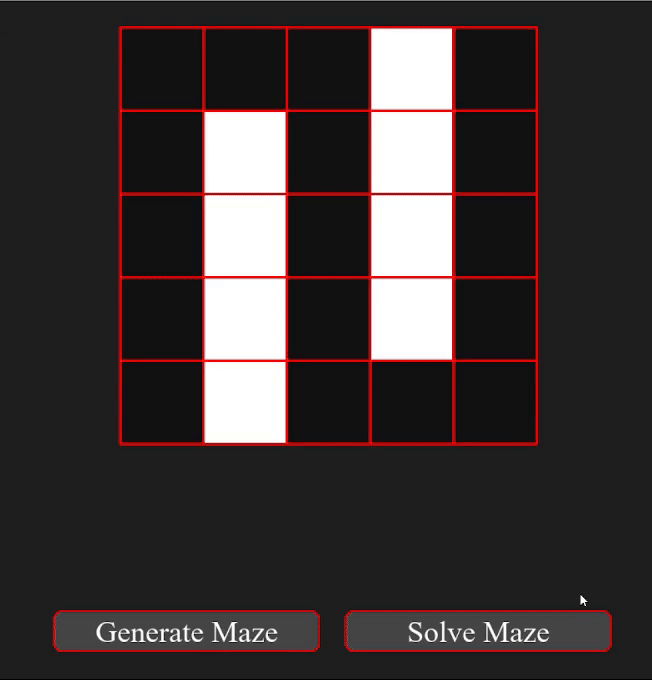
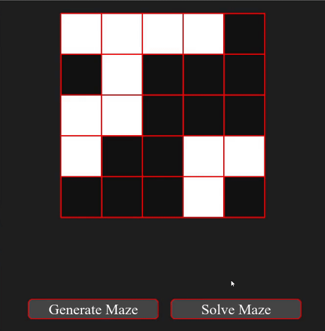
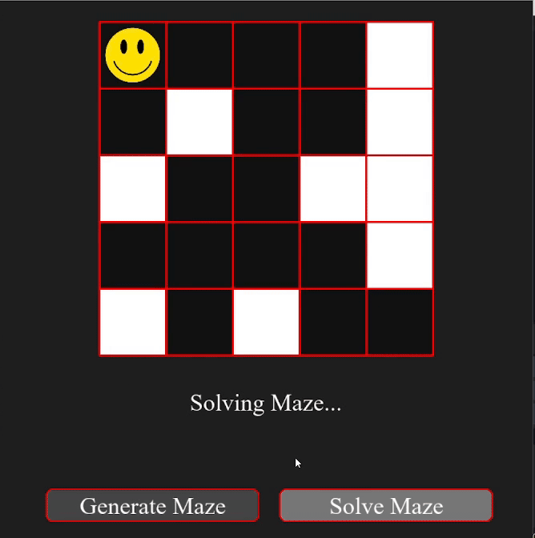

# MCTS Maze Solver

An AI Maze solver which uses the Monte Carlo Search Tree algorithm. While mazes can be solved with simpler algorithms like DFS or BFS, this project focuses on implementing and optimizing MCTS given its recent breakthroughs in games like Chess and Go.

This project has two main programs:
- MCTS maze solver in pure python (only Pygame for visualization)
- Gumbel MuZero (MCTS variant) maze solver using the jax-native MCTX library 

### MCTS Maze Solving (Pure python)
#### Solves mazes using Monte Carlo Tree Search algorithm.  

### MCTS Maze Generator (Pure python)
#### Random Maze Generator & Custom Maze Creator w/ Solvability Check (DFS search). 

### MCTS Maze Generator (MCTX & JAX)
#### Optimized maze solver using the MCTX library for more complex mazes.

